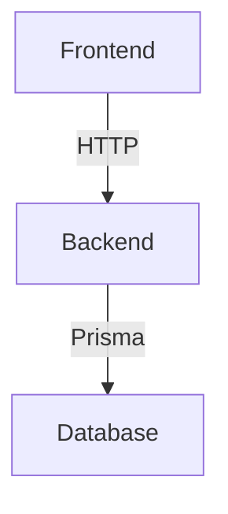

# Architecture

This document describes the architecture of the D&D Creator project.

## Backend (NestJS)

- RESTful API documented with Swagger (OpenAPI) at `/api/docs`
- JWT authentication
- Database access via Prisma
- Modular structure (modules, services, repositories)

## Frontend (Angular)

- Angular SPA
- Communicates with the backend API

## Database

- Modeled with Prisma
- Visualized with `npx prisma studio`

## Deployment

- See `docs/deployment.md`

## General Diagram

